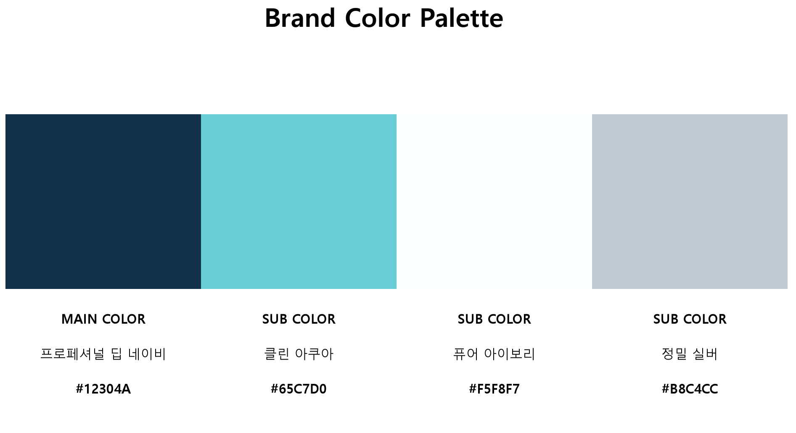
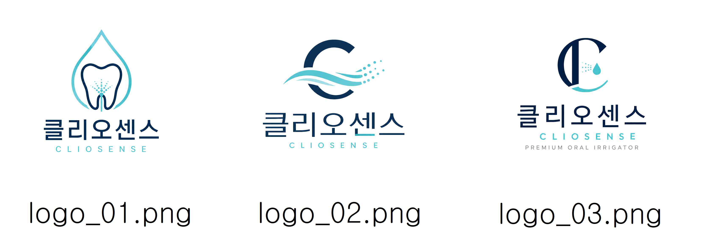
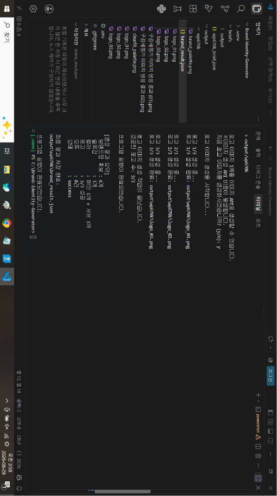
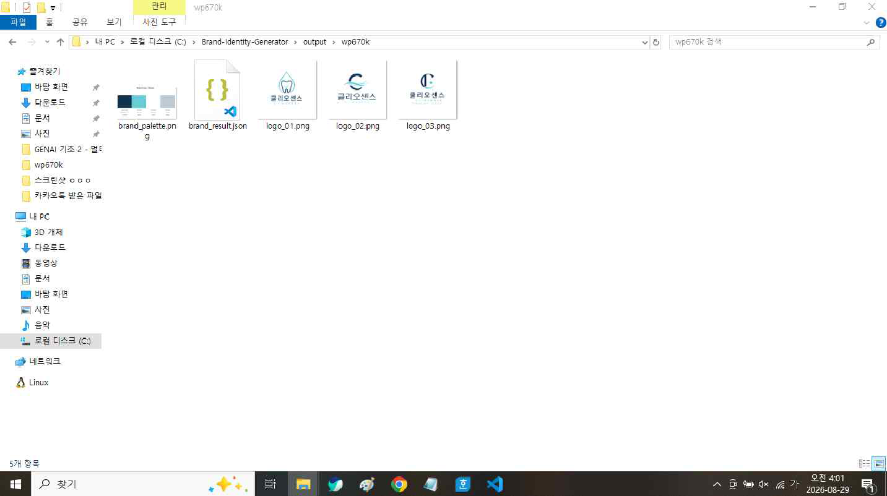
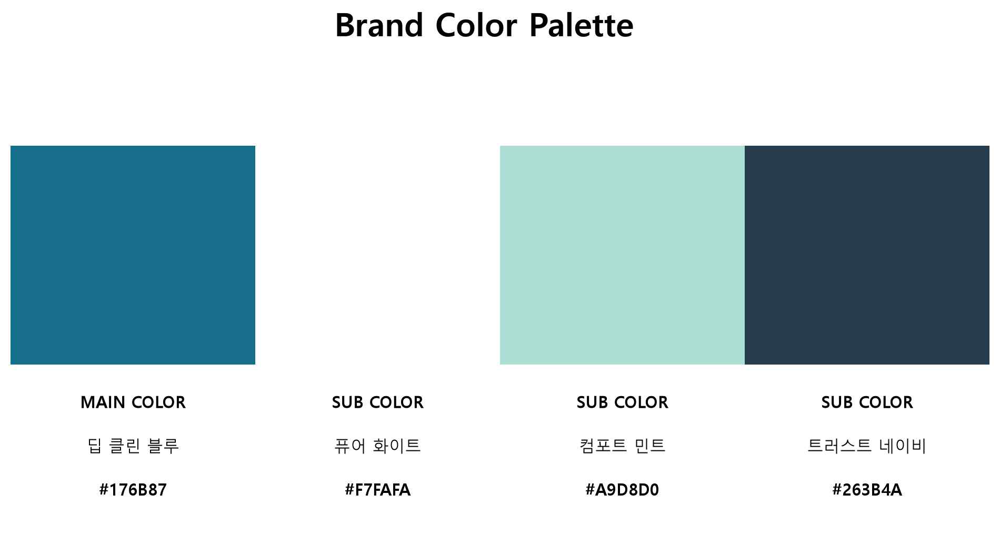
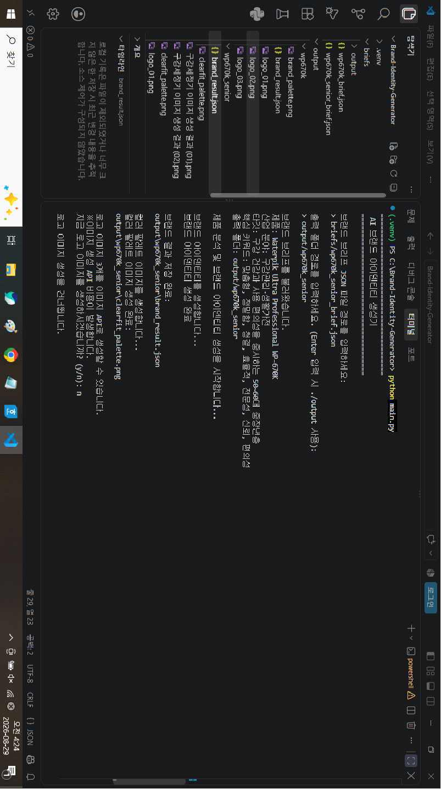
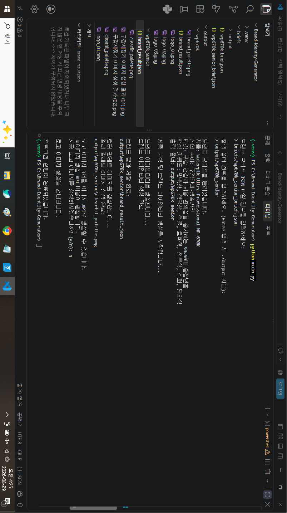
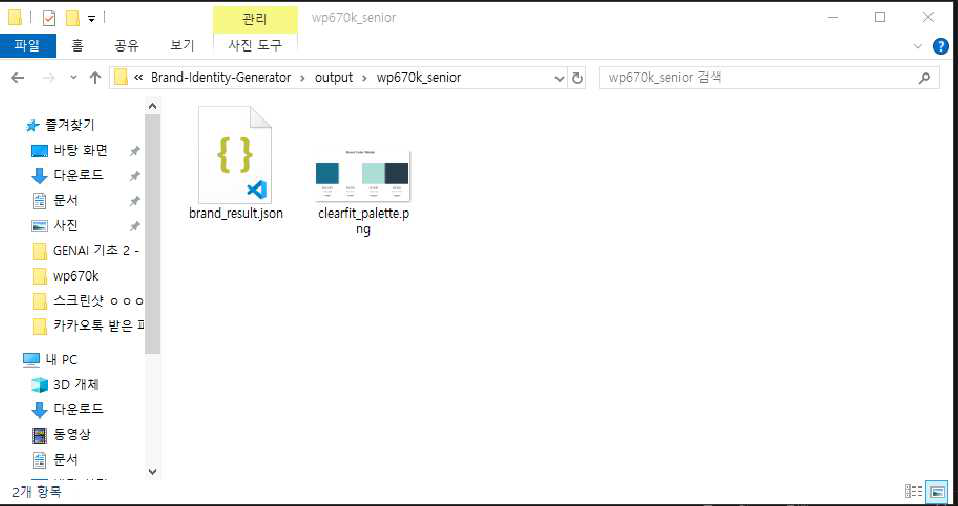

# AI 기반 제품 분석 및 타깃 맞춤형 브랜드 생성기

## 1. 프로젝트 개요

### 프로젝트명

**AI 기반 제품 분석 및 타깃 맞춤형 브랜드 생성기**

### 한 줄 소개

WP-670K 구강세정기의 주요 제품 특징을 사전에 정리하여 브랜드 브리프에
반영하고, AI가 이를 타깃 고객 관점에서 해석하여 브랜드
네이밍·슬로건·스토리·컬러·로고를 생성하는 프로그램

### 프로젝트 개발 목적

WP-670K의 주요 기능과 특징을 사전에 분석·정리하여 브랜드 브리프에
반영하고, AI가 이를 브랜드 기획에 활용할 핵심 가치와 타깃별 메시지로
해석하도록 구성하였다. 이후 네이밍, 슬로건, 브랜드 스토리, 컬러 팔레트,
로고 생성 과정을 하나의 파이프라인으로 연결하여 실제 제품 특징과 타깃
정보를 기반으로 일관성 있는 브랜드 아이덴티티 결과물을 생성하는 것을
목적으로 한다.

### 프로젝트의 방식

WP-670K 제품 자료에서 확인한 주요 기능과 특징을 브랜드 브리프 JSON에
정리한다. 프로그램은 입력된 제품 특징, 타깃, 키워드, 톤앤매너 등의
정보를 AI에 전달하여 브랜드 네이밍, 슬로건, 브랜드 스토리와 컬러를
생성하고, 생성 결과를 바탕으로 컬러 팔레트와 로고 시안을 만든다.

**전체 흐름**

`WP-670K 제품 특징 사전 정리 → 브랜드 브리프 JSON 구성 → 타깃 정보 반영 → AI 브랜드 네이밍 생성 → 슬로건 생성 → 브랜드 스토리 생성 → 컬러 팔레트 생성 → 로고 시안 생성 → JSON/PNG 저장`

### 1. 제품 분석

WP-670K 제품 자료에서 10단계 수압 조절, 90초 사용 가능한 물 용량,
치실·마사지 모드, 다양한 전용 팁 등의 주요 특징을 사전에 확인·정리하고,
이를 브랜드 브리프에 반영하였다. 프로그램에서는 이렇게 정리된 제품
특징과 타깃·키워드 정보를 AI에 전달하여 브랜드 기획에 활용할 핵심 가치와
메시지로 해석하도록 구성하였다. 단순히 제품 기능을 나열하는 것이 아니라,
각 기능이 타깃 고객에게 어떤 브랜드 가치로 전달될 수 있는지를 중심으로
브랜드 생성에 활용하였다.

### 2. 타깃 맞춤형 생성

하나의 WP-670K 제품을 대상으로 타깃 고객을 선택하고, 선택된 고객층에
적합한 브랜드 아이덴티티를 생성한다. 예를 들어 20\~30대 직장인, 가족,
교정 치료 사용자, 임플란트 사용자 등으로 타깃을 설정하고, 각 타깃에
적합한 브랜드명·슬로건·스토리·컬러·로고를 생성한다. WP-670K는 팁을
교체하여 가족이 함께 사용할 수 있으며, 제품 자료에서도 교정 및 임플란트
관리와 관련된 사용 특성을 별도로 제시하고 있어 타깃별 테스트에 활용할 수
있다.

### 3. 단계 간 연계

사전에 정리하여 브리프에 반영한 제품 특징과 USP를 이후 모든 브랜드 생성
단계에 계속 전달하여 결과물 사이의 일관성을 유지한다.

`제품 특징·USP → 네이밍 → 선택된 브랜드명과 타깃 → 슬로건·스토리 → 브랜드 컬러 → 브랜드명·컬러·제품 특징 → 로고`

앞 단계의 결과를 다음 단계의 입력 정보로 활용하여 브랜드명, 슬로건,
스토리, 컬러, 로고가 각각 독립적으로 생성되는 것이 아니라 하나의 브랜드
콘셉트를 중심으로 서로 연결되도록 구성한다.

------------------------------------------------------------------------

## 3. 테스트 대상 제품

  ---------------------------------------------------------------------
  항목                               내용
  ---------------------------------- ----------------------------------
  제품명                             Waterpik Ultra Professional
                                     WP-670K

  제품 종류                          구강세정기(Water Flosser)

  업종                               구강관리·생활가전

  제품 자료                          제조사 홈페이지 제공 Waterpik
                                     Ultra Professional WP-670K 제품
                                     소개
  ---------------------------------------------------------------------

### 이 제품을 테스트 대상으로 선정한 이유

WP-670K는 10단계 수압 조절, 치실·마사지 모드, 다양한 전용 팁, 90초 사용
가능한 물 용량 등 브랜드 기획에 활용할 수 있는 제품 특징이 다양하고
구체적으로 제시되어 있어, 주요 특징을 사전에 정리하고 이를 타깃별 핵심
가치와 USP로 연결하기에 적합하다.

또한 가족 공동 사용, 교정 및 임플란트 관리 등 서로 다른 사용 상황을 제품
자료에서 확인할 수 있어 하나의 제품을 대상으로 타깃 고객을 변경하면서
브랜드 네이밍·슬로건·컬러·로고가 어떻게 달라지는지 비교하기에 적합하여
테스트 제품으로 선정하였다.

------------------------------------------------------------------------

## 4. 제품 분석 결과

### 제품 자료에서 사전에 정리한 주요 제품 특징

-   **10단계 수압 조절** --- 사용자의 구강 상태와 선호도에 따라 세정
    강도를 세밀하게 조절할 수 있다.
-   **2가지 구강세정 모드** --- 일반적인 세정을 위한 치실 모드와 잇몸
    자극 및 마사지를 위한 마사지 모드를 제공한다.
-   **90초 사용 가능한 물 용량** --- 한 번 물을 채워 비교적 여유 있게
    구강세정을 진행할 수 있다.
-   **다양한 용도의 8개 팁 제공** --- 일반 제트 팁을 비롯하여 플라그
    시커, 치열교정, 픽 포켓, 혀 클리너 등 사용 목적에 맞는 팁을
    제공한다.
-   **30초 페이서 및 1분 타이머** --- 구강세정 시간을 확인하면서
    체계적으로 사용할 수 있도록 시간 안내 기능을 제공한다.
-   **360도 회전 팁** --- 팁의 방향을 조절하여 구강 내 필요한 부위에
    접근할 수 있도록 설계되어 있다.
-   **가족 공동 사용 가능** --- 사용자의 팁을 교체하는 방식으로 가족
    구성원이 하나의 본체를 함께 사용할 수 있다.

### 핵심 USP(차별화 포인트)

1.  **10단계 수압과 2가지 세정 모드를 활용한 맞춤형 구강관리**\
    사용자가 원하는 세정 강도와 방식을 선택할 수 있다는 점을 핵심 가치로
    활용한다.

2.  **다양한 전용 팁을 활용한 사용자별 세분화된 관리**\
    일반적인 구강세정뿐 아니라 치열교정 등 서로 다른 관리 목적에 대응할
    수 있는 다양한 팁을 제공한다.

3.  **하나의 제품으로 여러 가족 구성원이 사용할 수 있는 활용성**\
    팁을 교체하여 가족이 함께 사용할 수 있으므로 개인뿐 아니라 가족
    단위의 구강관리 제품으로 활용할 수 있다.

### 제품 핵심 키워드

**맞춤형 · 정밀함 · 청결 · 전문성 · 편리함 · 가족 · 체계적인 구강관리**

이 키워드는 이후 브랜드 네이밍 → 슬로건 → 스토리 → 컬러 → 로고 생성에
공통으로 활용한다.

------------------------------------------------------------------------

## 5. 타깃 고객 설정

### 선택한 주요 타깃

**20\~30대 직장인**

### 타깃의 특징

일상생활이 바쁘고 효율적인 자기관리를 중요하게 생각하며, 사용이
편리하면서도 체계적으로 구강을 관리할 수 있는 제품을 선호하는 고객층으로
설정한다. 브랜드를 생성할 때에는 간편함·깔끔함·정밀함·현대적인 이미지를
중심으로 표현한다.

### 타깃을 이렇게 설정한 이유

WP-670K는 30초 페이서와 1분 타이머를 제공하고, 10단계 수압 조절과 2가지
세정 모드를 갖추고 있어 사용자가 자신의 선호에 맞춰 구강세정을 설정할 수
있다. 따라서 본 프로젝트에서는 이러한 기능을 시간 관리와 자기관리를
중요하게 생각하는 20\~30대 직장인을 위한 '간편하면서도 맞춤화된
구강관리'라는 브랜드 콘셉트로 연결하여 테스트하고자 한다.

**타깃 브랜드 방향:** 세련됨 · 간편함 · 정밀함 · 청결함 · 현대적 이미지

### 지원하는 다른 타깃

1.  **자녀가 있는 가족** --- 팁을 교체하여 여러 가족 구성원이 함께
    사용할 수 있다는 특징을 활용해 가족·건강·신뢰·편리함 중심의 브랜드를
    생성한다.
2.  **교정 치료 사용자** --- 제품에 포함된 치열교정용 팁을 활용하여
    정밀함·전문성·세밀한 관리 중심의 브랜드를 생성한다.
3.  **임플란트 관리에 관심이 있는 사용자** --- 제품 자료에서 임플란트
    치아 관리가 별도로 다뤄지고 있다는 점을 활용하여 전문적인
    관리·청결·신뢰 중심의 브랜드 콘셉트를 생성한다.

------------------------------------------------------------------------

## 6. 브랜드 브리프 입력

브랜드 브리프(Brand Brief)는 어떤 브랜드를 만들 것인지 AI나 디자이너에게
알려주는 기본 기획 정보이다. 프로그램은 JSON 형식의 브랜드 브리프를
입력받도록 구성한다.

-   **필수 필드:** `industry`, `target`, `keywords`
-   **선택 필드:** `product_name`, `tone`, `competitors`, `notes`,
    `style_examples`

`style_examples`는 생성되는 브랜드명, 슬로건, 브랜드 스토리의 문장
길이와 톤, 전문적이고 간결한 분위기를 AI가 참고할 수 있도록 제공하는
문체 참고 예시이다. 해당 항목이 없는 기존 브랜드 브리프도 정상적으로
사용할 수 있도록 선택 항목으로 구성하였다.

``` json
{
  "product_name": "Waterpik Ultra Professional WP-670K",
  "industry": "구강관리·생활가전",
  "target": "효율적인 자기관리와 구강 건강에 관심이 있는 20~30대 직장인",
  "keywords": [
    "맞춤형",
    "정밀함",
    "청결",
    "효율적",
    "전문성",
    "신뢰",
    "편의성"
  ],
  "tone": "세련되고 깔끔하며 전문적인",
  "competitors": [
    "Philips Sonicare",
    "Panasonic Doltz"
  ],
  "notes": "WP-670K의 10단계 수압 조절, 치실·마사지 모드, 다양한 전용 팁, 30초 페이서와 1분 타이머 등의 제품 특징을 반영하여 바쁜 직장인이 간편하면서도 체계적으로 구강관리를 할 수 있다는 브랜드 이미지를 강조한다.",
  "style_examples": [
    "바쁜 하루에도, 정밀한 구강 루틴.",
    "복잡하지 않게, 전문가처럼 깨끗하게."
  ]
}
```

프로그램은 `style_examples`의 문장을 그대로 복사하도록 지시하는 것이
아니라 문장의 길이·톤·전문적이고 간결한 분위기만 참고하도록 프롬프트에
전달한다. 또한 리스트 형식인지, 각 항목이 비어 있지 않은 문자열인지
검증한다.

------------------------------------------------------------------------

## 7. 프로그램 전체 실행 흐름

``` text
WP-670K 제품 특징 사전 정리
        ↓
타깃 고객 설정
        ↓
브랜드 브리프 JSON 구성
        ↓
브랜드 브리프 파일 입력 및 검증
        ↓
기존 brand_result.json 확인
        ↓
기존 결과 있음 → 기존 JSON 불러오기
                 → metadata / errors / logos 자동 보완(마이그레이션)
                 → 텍스트 API 재호출 없이 기존 결과 사용

기존 결과 없음 → OpenAI API를 이용한 신규 브랜드 아이덴티티 생성
        ↓
LLM 응답 JSON 파싱 및 스키마 검증
        ↓
검증 성공 → 브랜드 네이밍·슬로건·브랜드 스토리·컬러 결과 사용
검증 실패 → 오류 내용을 반영하여 LLM에 자동 재질문 → 최대 3회 검증
        ↓
브랜드 컬러 검증 및 생성
        ↓
컬러 팔레트 PNG 시각화
        ↓
AI 로고 시안 3개 생성
        ↓
API 호출 실패 시 최대 3회까지 호출 시도 및 단계적 백오프 적용
        ↓
로고 최종 실패 시 errors에 오류 기록 후 다음 로고 생성 계속
        ↓
brand_result.json / 컬러 팔레트 PNG / 로고 PNG 결과 저장
        ↓
metadata에 실행 상태 및 생성 결과 개수 기록
        ↓
최종 생성 결과 요약 출력
```

### 파이프라인 설명

본 프로젝트에서는 WP-670K 제품 자료를 프로그램이 직접 읽어 자동 분석하는
방식이 아니라, 제품 자료에서 확인한 주요 기능과 특징을 사전에 정리하여
브랜드 브리프 JSON에 반영하였다.

프로그램은 브랜드 브리프를 검증한 뒤 기존 `brand_result.json`의 존재
여부를 확인한다. 기존 결과가 있으면 텍스트 생성 API를 다시 호출하지 않고
결과를 재사용하며, `metadata`, `errors`, `logos`가 없는 이전 형식의
JSON은 자동 마이그레이션한다.

신규 생성 시 LLM 응답을 JSON으로 변환한 뒤 브랜드명 3\~5개, 슬로건 3개,
브랜드 스토리, 메인 컬러 1개, 서브 컬러 2\~3개와 HEX 코드 등의 구조를
검증한다. 요구 형식에 맞지 않으면 오류 내용을 반영해 LLM에 자동
재질문하고 최대 3회까지 검증한다.

컬러는 HEX 형식을 검증한 뒤 `matplotlib`으로 PNG 팔레트를 생성한다.
로고는 총 3개를 생성하며 API 오류 시 최대 3회까지 호출을 시도하는 백오프
구조를 적용한다. 특정 로고가 최종 실패하면 `errors`에 기록하고 다음 로고
생성을 계속한다. 마지막으로 결과와 오류·실행 상태를
`brand_result.json`에 저장하고 최종 생성 결과를 터미널에 요약 출력한다.

------------------------------------------------------------------------

## 8. 사용자 입력 방식

프로그램 실행 시 `print()`를 통해 입력 안내 문구를 보여주고, `input()`을
이용하여 브랜드 브리프 JSON 파일 경로와 결과물을 저장할 출력 폴더 경로를
입력받는다.

  입력 항목          예시
  ------------------ ------------------------------
  브리프 파일 경로   `./briefs/wp670k_brief.json`
  출력 폴더 경로     `./output/wp670k`
  기본 출력 폴더     `./output`

실제 실행 화면은 다음과 같이 구성한다.

``` text
========================================
AI 브랜드 아이덴티티 생성기
========================================
브랜드 브리프 JSON 파일 경로를 입력하세요:
> ./briefs/wp670k_brief.json

출력 폴더 경로를 입력하세요. (Enter 입력 시 ./output 사용):
> ./output/wp670k

브랜드 브리프를 불러왔습니다.
제품: Waterpik Ultra Professional WP-670K
타깃: 20~30대 직장인

제품 분석 및 브랜드 아이덴티티 생성을 시작합니다...
```

출력 폴더 경로에서 아무것도 입력하지 않고 Enter를 누르면 `./output`을
기본 저장 위치로 사용하도록 구현한다. 브랜드 브리프 파일 경로는 반드시
입력하도록 처리한다.

------------------------------------------------------------------------

## 9. 브랜드 네이밍 생성

**사용한 LLM/API:** OpenAI Responses API / GPT-5.6 Luna

### 실제 생성된 브랜드명 후보

  -----------------------------------------------------------------------
  후보                    브랜드명                의미/유래
  ----------------------- ----------------------- -----------------------
  1                       **클리오센스**          Clean과 Sense의
                                                  결합으로, 정밀하고
                                                  감각적인 맞춤형
                                                  구강관리 경험을
                                                  의미합니다.

  2                       **덴티큐브**            Dental과 Cube의
                                                  결합으로, 다양한 기능과
                                                  팁을 체계적으로 조합해
                                                  관리하는 전문성을
                                                  상징합니다.

  3                       **오랄리듬**            Oral과 Rhythm의
                                                  결합으로, 바쁜 일상
                                                  속에서도 규칙적이고
                                                  효율적인 구강관리
                                                  습관을 의미합니다.

  4                       **프레시포인트**        구강관리의 핵심 지점을
                                                  정확하게 케어해
                                                  깨끗함과 상쾌함을
                                                  완성한다는 뜻입니다.
  -----------------------------------------------------------------------

**대표 브랜드명:** 클리오센스

------------------------------------------------------------------------

## 10. 슬로건/태그라인 생성

실제 `brand_result.json`에서 생성된 슬로건은 다음 3개이다.

1.  **바쁜 하루에도, 정밀한 구강 루틴**
2.  **내게 맞춘 수압, 전문가처럼 깨끗하게**
3.  **1분의 습관으로 완성하는 오랄 케어**

### 슬로건과 타깃/톤앤매너의 관계

주요 타깃인 20\~30대 직장인의 바쁜 일상과 효율적인 자기관리 성향을
반영하여 짧고 직관적인 슬로건이 생성되었다. 첫 번째 슬로건은 바쁜
일상에서도 정밀하고 체계적인 구강관리 루틴을 유지할 수 있다는 점을
강조한다. 두 번째 슬로건은 WP-670K의 10단계 수압 조절 기능을 맞춤형
관리와 전문성의 이미지로 연결한다. 세 번째 슬로건은 1분 타이머 기능을
활용하여 짧은 시간의 꾸준한 관리가 효과적인 자기관리 습관으로 이어질 수
있다는 메시지를 전달한다.

이를 통해 클리오센스의 핵심 가치인 정밀함·청결함·효율성·전문성·편의성을
20\~30대 직장인에게 적합한 세련되고 실용적인 메시지로 표현하였다.

------------------------------------------------------------------------

## 11. 브랜드 스토리

### 브랜드 스토리

클리오센스는 바쁜 업무와 일상 속에서도 구강관리를 포기하지 않는 20\~30대
직장인을 위해 탄생했습니다. 매일 반복되는 관리가 번거로운 의무가 아니라,
나에게 맞는 방식으로 완성하는 스마트한 자기관리라는 생각에서
출발했습니다. 10단계 수압 조절과 치실·마사지 모드, 다양한 전용 팁을 통해
각자의 구강 상태와 루틴에 맞춘 정밀한 케어를 제공합니다. 30초 페이서와
1분 타이머로 짧은 시간에도 체계적인 관리를 돕는 것이 철학입니다.
클리오센스는 전문성과 편의성을 바탕으로 누구나 신뢰할 수 있는 구강관리
기준을 만들고, 더 건강하고 자신감 있는 일상을 실현하는 브랜드로 성장해
나갑니다.

이 문장은 실제 `brand_result.json`에 저장된 브랜드 스토리와 동일합니다.

### 탄생 배경

바쁜 업무와 일상 속에서도 구강관리를 중요하게 생각하는 20\~30대 직장인이
자신의 생활 방식에 맞춰 효율적으로 관리할 수 있도록 돕기 위해
탄생하였다.

### 브랜드 철학

구강관리를 번거로운 의무가 아니라 개인의 구강 상태와 생활 루틴에 맞게
완성하는 스마트한 자기관리로 바라본다. 10단계 수압 조절과 다양한 세정
기능, 시간 안내 기능을 통해 짧은 시간에도 체계적이고 정밀한 관리를
돕는다.

### 브랜드 비전

전문성과 편의성을 바탕으로 누구나 신뢰할 수 있는 구강관리 기준을 만들고,
더 건강하고 자신감 있는 일상을 실현하는 브랜드로 성장하는 것을 지향한다.

------------------------------------------------------------------------

## 12. 컬러 팔레트

  구분              컬러명                 HEX 코드    주요 이미지
  ----------------- ---------------------- ----------- -----------------------
  **메인 컬러**     프로페셔널 딥 네이비   `#12304A`   전문성, 신뢰감
  **서브 컬러 1**   클린 아쿠아            `#65C7D0`   청결함, 상쾌함
  **서브 컬러 2**   퓨어 아이보리          `#F5F8F7`   위생, 깨끗함
  **서브 컬러 3**   정밀 실버              `#B8C4CC`   정밀함, 현대적 이미지

### 컬러 선정 이유

AI가 생성한 브랜드 컬러는 주요 타깃인 20\~30대 직장인과 클리오센스의
정밀함·청결함·전문성·편의성이라는 브랜드 방향을 반영하고 있다. 메인
컬러인 프로페셔널 딥 네이비(`#12304A`)는 전문성과 신뢰감을 전달하며,
구강관리 제품이 갖추어야 할 안정적이고 체계적인 이미지를 표현한다.

서브 컬러인 클린 아쿠아(`#65C7D0`)는 물을 이용하는 구강세정기의 특성과
청결하고 상쾌한 이미지를 표현한다. 퓨어 아이보리(`#F5F8F7`)는 위생적이고
깨끗한 이미지를 보완하며, 정밀 실버(`#B8C4CC`)는 WP-670K의 정밀한 기능과
현대적인 생활가전 이미지를 나타낸다.

### 타깃 고객과 컬러의 관계

20\~30대 직장인을 주요 타깃으로 설정했기 때문에 지나치게 화려한
색상보다는 세련되고 전문적이면서 청결한 인상을 전달하는 컬러 조합이
생성되었다. 딥 네이비는 신뢰성과 전문성을 강조하고, 아쿠아와 아이보리는
깨끗하고 상쾌한 구강관리 이미지를 전달한다. 실버 계열은 정밀하고
현대적인 제품 이미지를 보완한다.

이 구성은 원 과제에서 요구하는 메인 컬러 1개 + 서브 컬러 2\~3개 및 HEX
코드 조건을 충족한다. 생성된 컬러 정보는 `matplotlib`을 이용하여
**`brand_palette.png`**로 시각화하고, 로고 생성 단계에서도 브랜드 컬러
정보로 활용하였다.

------------------------------------------------------------------------

## 13. 컬러 팔레트 시각화

**사용한 라이브러리/방법:** Python `matplotlib`

AI가 생성한 클리오센스(CLIOSENSE)의 메인 컬러 1개와 서브 컬러 3개를
직사각형 컬러 블록으로 배치하고, 각 영역에 컬러명과 HEX 코드를 표시한 뒤
PNG 이미지로 저장하였다.

**저장 파일명:** `brand_palette.png`

### 팔레트 레이아웃을 이렇게 만든 이유

클리오센스의 브랜드 컬러를 한눈에 비교할 수 있도록 메인 컬러와 서브
컬러를 동일한 형태의 가로형 컬러 블록으로 구성하였다. 각 블록에는
컬러명과 HEX 코드를 함께 표시하여 각 색상의 정보를 쉽게 확인할 수 있도록
하였다.

메인 컬러인 프로페셔널 딥 네이비를 가장 먼저 배치하고 그 뒤에 서브
컬러를 순서대로 배치함으로써 브랜드의 주색과 보조색 관계가 명확하게
나타나도록 구성하였다. 실제 프로그램 실행 결과 `output/wp670k` 폴더에
**`brand_palette.png`**가 정상적으로 저장된 것을 확인하였다.

### 실제 컬러 팔레트 이미지



------------------------------------------------------------------------

## 14. AI 로고 시안

**사용한 이미지 생성 API/모델:** OpenAI Images API / GPT-Image-2

### 로고 시안 1 --- `logo_01.png`

물방울과 치아 이미지를 결합하여 WP-670K의 물을 이용한 구강세정 기능을
직관적으로 표현하였다. 실제 브랜드 컬러인 클린 아쿠아(`#65C7D0`)와
프로페셔널 딥 네이비(`#12304A`) 계열을 활용하여 청결함과 전문성을
강조하고, 단순하고 깔끔한 형태를 적용하여 **클리오센스(CLIOSENSE)**의
현대적인 브랜드 이미지를 나타냈다.

### 로고 시안 2 --- `logo_02.png`

물의 흐름을 형상화한 곡선과 CLIOSENSE 워드마크를 결합하였다. WP-670K의
수압을 이용한 세정 방식과 정밀한 구강관리 이미지를 표현하고, 클린
아쿠아와 프로페셔널 딥 네이비 계열을 함께 사용하여 청결함과 신뢰감 있는
전문성을 나타냈다. 주요 타깃인 20\~30대 직장인을 고려하여 복잡한
장식보다는 세련되고 간결한 디자인을 적용하였다.

### 로고 시안 3 --- `logo_03.png`

브랜드명 CLIOSENSE의 첫 글자인 C를 중심으로 물방울 요소를 결합한 심볼형
로고로 구성하였다. 브랜드를 쉽게 인식할 수 있는 간결한 형태를 사용하면서
물을 이용한 구강관리 제품이라는 특징을 함께 표현하였다. 딥 네이비와
아쿠아 계열을 활용하여 정밀하고 신뢰감 있는 프리미엄 자기관리 브랜드
이미지를 강조하였다.

### 로고 프롬프트에 전달한 정보

대표 브랜드명 클리오센스(CLIOSENSE), 제품 종류인 구강세정기, WP-670K의
물을 이용한 구강세정 방식, 10단계 수압 조절, 치실·마사지 모드, 다양한
전용 팁 등의 제품 특징과 주요 타깃인 20\~30대 직장인 정보를 이미지 생성
프롬프트에 반영하였다.

브랜드 핵심 키워드인 맞춤형·정밀함·청결·효율적·전문성·신뢰·편의성과
세련되고 깔끔하며 전문적인 톤앤매너를 함께 전달하였다.

-   `logo_01.png` --- 물방울 + 치아 + 물 분사 이미지
-   `logo_02.png` --- C 형태 + 물결/분사 + CLIOSENSE 워드마크
-   `logo_03.png` --- C 모노그램 + 물방울 + CLIOSENSE 워드마크

### 실제 로고 시안 이미지



------------------------------------------------------------------------

## 15. 결과 저장

### 출력 폴더

``` text
C:\Brand-Identity-Generator
└── output
    ├── wp670k
    │   ├── brand_result.json
    │   ├── brand_palette.png
    │   ├── logo_01.png
    │   ├── logo_02.png
    │   └── logo_03.png
    └── wp670k_senior
        ├── brand_result.json
        └── brand_palette.png
```

`output/wp670k`에는 20\~30대 직장인 대상의 브랜드 결과, 컬러 팔레트,
로고 이미지 3개를 저장하였다. `output/wp670k_senior`에는 타깃 변경 비교
테스트를 위해 50\~60대 중장년층 대상의 결과와 컬러 팔레트를 별도로
저장하였다.

최종 `brand_result.json`에는 브랜드 생성 결과뿐 아니라 다음 관리 정보도
함께 저장한다.

-   `metadata`: 실행 상태, 출력 경로, 브랜드명·슬로건·로고 생성 수 등
-   `errors`: 최종적으로 해결되지 않은 오류 정보
-   `logos`: 성공적으로 생성된 로고 파일명 목록

이를 통해 생성 결과와 실행 상태 및 오류 정보를 하나의 JSON 파일에서
확인할 수 있도록 구성하였다.

------------------------------------------------------------------------

## 16. `brand_result.json` 결과

``` json
{
  "brand_names": [
    {
      "name": "클리오센스",
      "meaning": "Clean과 Sense의 결합으로, 정밀하고 감각적인 맞춤형 구강관리 경험을 의미합니다."
    },
    {
      "name": "덴티큐브",
      "meaning": "Dental과 Cube의 결합으로, 다양한 기능과 팁을 체계적으로 조합해 관리하는 전문성을 상징합니다."
    },
    {
      "name": "오랄리듬",
      "meaning": "Oral과 Rhythm의 결합으로, 바쁜 일상 속에서도 규칙적이고 효율적인 구강관리 습관을 의미합니다."
    },
    {
      "name": "프레시포인트",
      "meaning": "구강관리의 핵심 지점을 정확하게 케어해 깨끗함과 상쾌함을 완성한다는 뜻입니다."
    }
  ],
  "slogans": [
    "바쁜 하루에도, 정밀한 구강 루틴",
    "내게 맞춘 수압, 전문가처럼 깨끗하게",
    "1분의 습관으로 완성하는 오랄 케어"
  ],
  "brand_story": "클리오센스는 바쁜 업무와 일상 속에서도 구강관리를 포기하지 않는 20~30대 직장인을 위해 탄생했습니다. 매일 반복되는 관리가 번거로운 의무가 아니라, 나에게 맞는 방식으로 완성하는 스마트한 자기관리라는 생각에서 출발했습니다. 10단계 수압 조절과 치실·마사지 모드, 다양한 전용 팁을 통해 각자의 구강 상태와 루틴에 맞춘 정밀한 케어를 제공합니다. 30초 페이서와 1분 타이머로 짧은 시간에도 체계적인 관리를 돕는 것이 철학입니다. 클리오센스는 전문성과 편의성을 바탕으로 누구나 신뢰할 수 있는 구강관리 기준을 만들고, 더 건강하고 자신감 있는 일상을 실현하는 브랜드로 성장해 나갑니다.",
  "colors": {
    "main": {
      "name": "프로페셔널 딥 네이비",
      "hex": "#12304A"
    },
    "sub": [
      {
        "name": "클린 아쿠아",
        "hex": "#65C7D0"
      },
      {
        "name": "퓨어 아이보리",
        "hex": "#F5F8F7"
      },
      {
        "name": "정밀 실버",
        "hex": "#B8C4CC"
      }
    ]
  },
  "errors": [],
  "logos": [
    "logo_01.png",
    "logo_02.png",
    "logo_03.png"
  ],
  "metadata": {
    "status": "success",
    "output_directory": "output/wp670k",
    "brand_name_count": 4,
    "slogan_count": 3,
    "logo_success_count": 3
  }
}
```

최종 실행 결과에서는 오류가 발생하지 않아 `errors`가 빈 리스트(`[]`)로
저장되었고, 로고 3개가 정상 생성되어 `logos`에 기록되었다.
`metadata.status`는 `success`이며 브랜드명 후보 4개, 슬로건 3개, 로고
3개가 성공적으로 생성된 것을 확인할 수 있다.

------------------------------------------------------------------------

## 17. 프로그램 구조

``` text
Brand-Identity-Generator/
├── main.py
├── requirements.txt
├── .gitignore
├── .env
├── briefs/
│   ├── wp670k_brief.json
│   └── wp670k_senior_brief.json
└── output/
    ├── wp670k/
    │   ├── brand_result.json
    │   ├── brand_palette.png
    │   ├── logo_01.png
    │   ├── logo_02.png
    │   └── logo_03.png
    └── wp670k_senior/
        ├── brand_result.json
        └── brand_palette.png
```

### 각 파일의 역할

  -----------------------------------------------------------------------
  파일                                역할
  ----------------------------------- -----------------------------------
  `main.py`                           사용자 입력, 브리프 검증, OpenAI
                                      API 기반 텍스트·로고 생성, 컬러
                                      팔레트 시각화, 결과 저장, 기존 JSON
                                      마이그레이션, API 재시도, LLM 구조
                                      검증·자동 재질문, HEX 검증·대체,
                                      오류 기록, 메타데이터 관리

  `briefs/wp670k_brief.json`          WP-670K의 20\~30대 직장인 타깃 입력
                                      정보와 `style_examples` 저장

  `briefs/wp670k_senior_brief.json`   50\~60대 중장년층 타깃 비교용 입력
                                      정보와 `style_examples` 저장

  `requirements.txt`                  `openai`, `python-dotenv`,
                                      `matplotlib` 등 필요한 라이브러리
                                      관리

  `.gitignore`                        `.env`, `.venv`, 캐시 파일 등
                                      제출/Git 제외 항목 지정

  `.env`                              OpenAI API Key 환경변수 관리.
                                      **제출 ZIP에는 포함하지 않음**

  `output/wp670k/brand_result.json`   브랜드 결과 + `errors` + `logos` +
                                      `metadata` 저장

  `output/wp670k/brand_palette.png`   메인·서브 컬러 팔레트 이미지

  `output/wp670k/logo_01.png` \~      AI 로고 시안 3개
  `logo_03.png`                       

  `output/wp670k_senior/`             타깃 B 비교 테스트 결과 저장
  -----------------------------------------------------------------------

기존 `brand_result.json`이 존재하면 텍스트 생성 API를 다시 호출하지 않고
기존 결과를 불러온다. 이전 형식에 `metadata`, `errors`, `logos`가 없으면
자동으로 추가하여 현재 형식으로 마이그레이션한다.

신규 LLM 결과는 JSON 변환 후 브랜드명 3\~5개, 슬로건 3개, 브랜드 스토리,
메인 컬러 1개, 서브 컬러 2\~3개와 HEX 코드 구조를 검증한다. 실패 시 오류
내용을 반영하여 최대 3회까지 자동 재질문한다.

API 호출에는 최대 3회까지 호출을 시도하는 백오프 구조를 적용하며, 특정
로고가 최종 실패하면 `errors`에 기록한 뒤 다음 로고 생성을 계속한다.
잘못된 HEX 값은 기본 HEX 값으로 대체하고 오류 정보를 기록한다. 실행 종료
시 브랜드명·슬로건·컬러·로고·오류·상태를 요약 출력한다.

------------------------------------------------------------------------

## 18. 사용 기술 및 개발 환경

  ---------------------------------------------------------------------
  항목                               내용
  ---------------------------------- ----------------------------------
  Python 버전                        Python 3.14.7

  LLM API/모델                       OpenAI Responses API / GPT-5.6
                                     Luna

  이미지 생성 API/모델               OpenAI Images API / GPT-Image-2

  주요 Python 라이브러리             `openai`, `python-dotenv`,
                                     `matplotlib`, `json`, `pathlib`,
                                     `os`, `re`, `base64`

  개발 도구                          Visual Studio Code (VS Code),
                                     Windows 10, PowerShell, Python
                                     가상환경(`.venv`)
  ---------------------------------------------------------------------

------------------------------------------------------------------------

## 19. 설치 방법

``` bash
pip install -r requirements.txt
```

프로젝트를 내려받은 후 터미널에서 위 명령어를 실행하여 `openai`,
`python-dotenv`, `matplotlib` 등 필요한 Python 라이브러리를 설치한다.

------------------------------------------------------------------------

## 20. API Key 설정 방법

**필요한 API Key:** OpenAI API Key\
**환경변수 이름:** `OPENAI_API_KEY`

프로젝트 최상위 폴더에 `.env` 파일을 생성한 후 다음과 같이 설정한다.

``` env
OPENAI_API_KEY=발급받은_API_Key
```

`.env` 파일은 `.gitignore`에 등록하여 Git 저장소와 최종 제출 ZIP에
포함되지 않도록 한다.

------------------------------------------------------------------------

## 21. 실행 방법

``` text
python main.py
```

### 실행 순서

가상환경을 활성화한 후 `python main.py` 실행 → 브랜드 브리프 JSON 파일
경로 입력 → 출력 폴더 경로 입력 → 기존 `brand_result.json` 존재 여부
확인 → 기존 결과가 있으면 자동 마이그레이션 후 재사용 / 없으면 OpenAI
API로 신규 브랜드 생성 → 컬러 팔레트 생성 → 로고 이미지 생성 여부에서
`y` 또는 `n` 입력 → 결과 확인

``` text
python main.py

브랜드 브리프 JSON 파일 경로:
> briefs/wp670k_brief.json

출력 폴더 경로:
> output/wp670k

지금 로고 이미지를 생성하시겠습니까? (y/n):
> y
```

기존 `brand_result.json`이 있으면 브랜드 네이밍·슬로건·스토리·컬러를
위한 텍스트 API를 다시 호출하지 않고 기존 결과를 재사용한다. 이전 형식의
파일이면 `metadata`, `errors`, `logos`를 자동으로 보완한다.

정상 실행되면 `brand_result.json`, 컬러 팔레트 PNG, 로고 PNG 3개가
`output/wp670k`에 저장되며, `brand_result.json`에는 브랜드 결과와 함께
실행 상태·오류·로고 정보가 저장된다.

------------------------------------------------------------------------

## 22. 실제 실행 결과(실행 화면 캡처)

### 그림 1. 브랜드 브리프 입력 및 AI 로고 생성 실행 화면

WP-670K 브랜드 브리프와 출력 폴더를 입력한 후 기존 `brand_result.json`을
확인하여 텍스트 API를 재호출하지 않고 기존 결과를 재사용하고, 컬러
팔레트를 생성한 뒤 로고 이미지 생성을 시작한 화면이다.


### 그림 2. 로고 이미지 생성 완료 화면

`logo_01.png`, `logo_02.png`, `logo_03.png`가 순차적으로 생성되었으며,
최종 결과 요약에서 브랜드명 후보 4개, 슬로건 3개, 메인 컬러 1개와 서브
컬러 3개, 로고 3/3 성공, 오류 0건, 상태 `success`를 확인하였다.



### 그림 3. 최종 결과물 저장 화면

프로그램 실행 후 `output/wp670k` 폴더에 `brand_result.json`,
`brand_palette.png`, `logo_01.png`, `logo_02.png`, `logo_03.png`가
정상적으로 저장된 것을 확인하였다.



------------------------------------------------------------------------

## 23. 에러 처리

### API 호출 실패

네트워크 연결 오류, API 서버 오류, 사용량·크레딧 문제, 이미지 생성 실패
등으로 OpenAI API 호출이 정상 처리되지 않을 수 있다.

프로그램은 일시적인 API 오류가 발생하면 즉시 실패로 처리하지 않고 **최대
3회까지 API 호출을 시도**하며, 재시도 사이의 대기시간을 단계적으로
증가시키는 백오프(Backoff) 방식을 적용한다. 재시도를 통해 성공하면
중간의 일시적 오류는 최종 `errors`에 남기지 않는다.

특정 로고가 최종적으로 생성되지 않으면 오류를 `brand_result.json`의
`errors`에 기록하고 다음 로고 생성을 계속한다. 오류 정보에는 `stage`,
`item`, `message`, `attempts`를 기록한다.

### API Key 없음

``` text
OPENAI_API_KEY가 설정되어 있지 않습니다.
```

`.env` 파일에 다음과 같이 API Key를 설정한 후 다시 실행한다.

``` text
OPENAI_API_KEY=발급받은_API_Key
```

### 잘못된 API Key

``` text
[프로그램 오류] OpenAI API 인증에 실패했습니다.
.env 파일의 OPENAI_API_KEY가 올바른지 확인해주세요.
```

### 에러 처리 요약

파일 오류, JSON 형식 오류, 입력값 오류, 저장 권한 오류 및 API 관련
오류를 예외 처리한다. 해결되지 않은 최종 오류는 `errors`에 기록하며,
특정 로고의 실패가 전체 프로그램 중단으로 이어지지 않도록 나머지 로고
생성 작업을 계속 수행한다.

------------------------------------------------------------------------

## 24. 브랜드 브리프 및 생성 결과 예외 처리

### 브랜드 브리프 입력 정보가 부족한 경우

필수 항목인 `industry`, `target`, `keywords`가 없거나 비어 있으면 오류
메시지를 출력하여 사용자가 브랜드 브리프 JSON을 수정하도록 안내한다.
선택 항목도 입력된 경우 지정된 자료형과 값이 올바른지 검증한다.

### LLM 응답이 JSON 형식이 아니거나 변환할 수 없는 경우

AI 응답을 JSON으로 변환할 수 있는지 확인한다. JSON 파싱에 실패하면
잘못된 결과를 저장하거나 후속 작업에 사용하지 않고 오류 내용을 반영하여
LLM에 자동으로 재질문한다.

### LLM 생성 결과가 요구된 스키마와 다른 경우

JSON 변환 후에도 결과 구조를 검증한다. 브랜드명 후보는 3\~5개이며 각
항목에 `name`과 `meaning`이 있어야 하고, 슬로건은 정확히 3개인지
확인한다. 브랜드 스토리가 비어 있지 않은지, 메인 컬러 1개와 서브 컬러
2\~3개가 존재하는지, 각 컬러에 `name`과 `hex`가 포함되는지도 검증한다.

검증 실패 시 오류 내용을 프롬프트에 포함하여 LLM에 자동 재질문하고 최대
3회까지 결과를 다시 검증한다. 정상 결과를 얻지 못하면 오류를 기록하고
잘못된 결과가 후속 단계에 사용되지 않도록 한다.

### HEX 컬러 코드가 올바르지 않은 경우

메인·서브 컬러의 HEX 코드가 `#RRGGBB` 형식인지 검사한다. 잘못된 값은
미리 지정한 기본 HEX 값으로 대체하여 팔레트 생성을 계속하고, 대체 사실을
`errors`에 기록한다.

### 예외 처리 원칙

입력 단계에서는 브랜드 브리프 유효성을 검증하고, LLM 응답 단계에서는
JSON 파싱과 스키마 검증을 수행한다. 대체 가능한 오류는 기본값으로
보완하고 기록하며, 정상적인 브랜드 핵심 결과를 확보할 수 없는 중대한
오류는 후속 단계로 진행하지 않는다.

------------------------------------------------------------------------

## 25. 테스트

### 정상 입력 테스트

**입력:** `briefs/wp670k_brief.json`

브랜드명 4개, 슬로건 3개, 브랜드 스토리, 메인 컬러 1개와 서브 컬러 3개를
정상 처리하였다. 컬러 팔레트와 로고 3개도 생성되었으며 최종 실행
화면에서 로고 3/3 성공, 오류 0건, 상태 `success`를 확인하였다.

### 잘못된 JSON 테스트

괄호·쉼표·따옴표 등이 잘못된 JSON을 입력하면 `JSONDecodeError`를
감지하여 JSON 형식을 확인하라는 메시지를 출력하고 생성을 중단한다.

### 필수 필드 누락 테스트

`industry`, `target`, `keywords` 중 하나가 누락되면 `validate_brief()`가
누락 필드를 감지하여 잘못된 데이터가 AI 생성 단계로 전달되지 않도록
한다.

### style_examples 검증 테스트

`style_examples`가 입력된 경우 문자열 리스트인지, 각 항목이 비어 있지
않은 문자열인지 검증한다. 정상 값은 LLM 프롬프트의 문체 참고 정보로
사용하고, 해당 필드가 없는 기존 브리프도 정상적으로 처리한다.

### LLM 결과 스키마 검증 및 자동 재질문 테스트

스키마(Schema)는 데이터가 어떤 항목과 형식으로 구성되어야 하는지를 정한
규칙이다. 브랜드명 수, 슬로건 수, 스토리, 컬러 구조가 요구 스키마와 다른
응답을 가정하여 검증 기능을 확인하였다. 검증 실패 시 오류 내용을
반영하여 LLM에 자동 재질문하고 최대 3회까지 재검증하도록 구현하였다.

### API 재시도 테스트

API 호출이 처음 두 번 실패하고 세 번째 호출에서 성공하는 상황을 모의
테스트하였다. 최대 3회까지 호출을 시도하며 단계적 백오프를 적용하고,
최종 성공한 경우 중간의 일시적 오류는 `errors`에 남기지 않도록
처리하였다.

### 기존 brand_result.json 마이그레이션 테스트

이전 형식의 `brand_result.json`을 둔 상태에서 실행하여 기존 결과를
재사용하고 `metadata`, `errors`, `logos`를 자동으로 추가하는 것을
확인하였다. 기존 로고 파일도 확인하여 `logos` 정보에 반영한다.

### API 오류 및 최종 실패 처리 테스트

최대 호출 시도 후에도 해결되지 않은 API 오류는 사용자에게 출력하고
`errors`에 기록할 수 있도록 구성하였다.

### 이미지 생성 실패 테스트

로고 3개를 각각 독립적으로 생성하며 특정 로고가 최종 실패하면 해당
오류를 `errors`에 기록하고 다음 로고 생성을 계속한다. 정상 실행에서는
`logo_01.png`\~`logo_03.png`가 모두 생성되어 3/3 성공, 오류 0건, 상태
`success`를 확인하였다.

------------------------------------------------------------------------

## 26. 타깃 변경 비교 테스트 ⭐

  -----------------------------------------------------------------------
  항목                    타깃 A                  타깃 B
  ----------------------- ----------------------- -----------------------
  타깃                    효율적인 자기관리와     구강 건강과 사용
                          구강 건강에 관심이 있는 편의성을 중시하는
                          20\~30대 직장인         50\~60대 중장년층

  대표 브랜드명           **클리오센스**          **클린포커스**

  대표 슬로건             바쁜 하루에도, 정밀한   내게 맞춘 수압으로, 더
                          구강 루틴               정밀하게 깨끗하게

  메인 컬러               프로페셔널 딥 네이비    딥 클린 블루 `#176B87`
                          `#12304A`               
  -----------------------------------------------------------------------

### 결과 비교

동일한 Waterpik Ultra Professional WP-670K 제품을 대상으로 타깃을
변경하여 브랜드 아이덴티티 생성 결과를 비교하였다. 20\~30대 직장인을
대상으로 한 타깃 A에서는 '클리오센스'라는 브랜드명과 '바쁜 하루에도,
정밀한 구강 루틴'이라는 슬로건이 생성되어 바쁜 일상 속 효율적이고 세련된
자기관리 이미지를 강조하였다.

반면 50\~60대 중장년층을 대상으로 한 타깃 B에서는 '클린포커스'라는 보다
직관적인 브랜드명과 '내게 맞춘 수압으로, 더 정밀하게 깨끗하게'라는
슬로건이 생성되었다. 또한 메인 컬러도 프로페셔널 딥
네이비(`#12304A`)에서 딥 클린 블루(`#176B87`)로 변경되었다.

이를 통해 동일한 제품이라도 타깃에 따라 브랜드명, 슬로건, 컬러 및 브랜드
메시지가 달라지는 것을 확인하였다.

### 타깃 B 브랜드 컬러 팔레트



### 타깃 B 비교 테스트 실행 화면







### 타깃 B `brand_result.json`

``` json
{
  "brand_names": [
    {
      "name": "클린포커스",
      "meaning": "구강 구석구석을 정확하게 관리한다는 의미로, 정밀함과 청결함을 표현한 이름입니다."
    },
    {
      "name": "덴티케어 프로",
      "meaning": "치아를 뜻하는 덴티와 전문적인 관리를 뜻하는 케어 프로를 결합해 신뢰와 전문성을 강조합니다."
    },
    {
      "name": "바른워터케어",
      "meaning": "개인의 구강 상태에 맞는 올바르고 편안한 물 관리 습관을 제안한다는 의미입니다."
    },
    {
      "name": "웰덴스",
      "meaning": "건강과 치아를 뜻하는 웰니스와 덴탈을 결합해 매일의 구강 건강과 삶의 질 향상을 담았습니다."
    }
  ],
  "slogans": [
    "내게 맞춘 수압으로, 더 정밀하게 깨끗하게",
    "매일 편안하게, 전문가처럼 관리하다",
    "구강 건강의 기준을 바꾸는 맞춤 케어"
  ],
  "brand_story": "클린포커스는 구강 건강을 중요하게 생각하면서도 복잡한 사용법에는 부담을 느끼는 중장년층을 위해 탄생했습니다. 10단계 수압 조절과 치실·마사지 모드, 다양한 전용 팁을 통해 누구나 자신의 상태와 습관에 맞는 정밀한 관리를 할 수 있도록 돕습니다. 30초 페이서와 1분 타이머는 올바른 사용을 자연스럽게 안내하며, 우리의 철학인 전문성은 쉽게, 관리는 편안하게를 실현합니다. 클린포커스는 신뢰할 수 있는 기술과 친절한 경험으로 매일의 구강 관리를 건강한 생활 습관으로 만들고, 모든 세대가 더 오래 자신 있게 웃는 미래를 지향합니다.",
  "colors": {
    "main": {
      "name": "딥 클린 블루",
      "hex": "#176B87"
    },
    "sub": [
      {
        "name": "퓨어 화이트",
        "hex": "#F7FAFA"
      },
      {
        "name": "컴포트 민트",
        "hex": "#A9D8D0"
      },
      {
        "name": "트러스트 네이비",
        "hex": "#263B4A"
      }
    ]
  },
  "errors": [],
  "logos": [],
  "metadata": {
    "status": "success",
    "output_directory": "output/wp670k_senior",
    "brand_name_count": 4,
    "slogan_count": 3,
    "logo_success_count": 0
  }
}
```

------------------------------------------------------------------------

> ※ 본 비교 테스트 화면은 최종 결과 요약 기능을 추가하기 전에 수행한
> 실행 화면으로, 이후 프로그램 보완 과정에서 브랜드명·슬로건·컬러·로고
> 생성 수와 오류 및 실행 상태를 표시하는 최종 결과 요약 기능을
> 추가하였다. \## 27. 보너스 과제 1 --- 경쟁사 분석

본 프로젝트에서는 브랜드 브리프의 `competitors` 항목에 입력한 경쟁사를
참고하여 **경쟁사 제품의 주요 특징을 별도로 조사·비교하고, 이를 바탕으로
WP-670K의 브랜드 차별화 방향을 정리하였다.** 현재 프로그램이 웹에서
경쟁사 정보를 자동으로 수집·분석하는 구조는 아니며, 사전에 확인한 경쟁사
정보를 활용하여 비교 분석을 수행하였다.

### 경쟁사 1: Philips Sonicare

Power Flosser 제품군은 Quad Stream 기술을 활용하여 넓은 영역을
효율적으로 세정하고, Pulse Wave 기술을 통해 치아 사이의 이동을 안내하는
등 세정 기술과 사용 편의성을 강조하고 있다. 제품에 따라 다양한 세정
모드와 최대 10단계 강도 조절 기능을 제공하여 개인별 구강관리에도
대응한다.

### 경쟁사 2: Panasonic Doltz

Panasonic의 구강세정기 제품은 초음파 워터젯 기술을 활용한 세정을 주요
특징으로 내세우고 있다. EW1511의 경우 5단계 수압 조절과 무선·휴대형
설계를 제공하여 치아 사이와 치주 포켓 등의 세정뿐 아니라 사용 편의성과
휴대성을 강조한다.

### AI를 활용하여 정리한 차별화 포인트

1.  WP-670K의 10단계 수압 조절과 다양한 전용 팁을 활용하여 사용자의 구강
    상태와 관리 목적에 맞춘 **'맞춤형 구강관리'** 이미지를 강화한다.
2.  30초 페이서와 1분 타이머를 브랜드 메시지와 연결하여 바쁜 사용자도
    짧은 시간에 체계적인 구강관리 습관을 만들 수 있다는 점을 강조한다.
3.  단순한 세정 성능 경쟁보다 **'정밀함·전문성·편의성'**을 결합한 브랜드
    아이덴티티를 구축하여 사용자의 생활 방식과 타깃에 맞춰 차별화된
    브랜드 경험을 제안한다.

### 구현 범위

브랜드 브리프의 `competitors` 항목을 통해 경쟁사 정보를 입력하고 이를
브랜드 생성 과정의 참고 정보로 활용할 수 있도록 구성하였다. 다만
**경쟁사 정보를 웹이나 외부 API에서 자동으로 수집·분석하는 기능은
구현하지 않았으며**, 본 비교 분석은 사전에 확인한 경쟁사 정보를 바탕으로
작성하였다. 향후에는 경쟁사 제품 정보를 자동으로 수집하고 제품별 특징과
차별화 요소를 분석하는 기능으로 확장할 수 있다.

------------------------------------------------------------------------

## 28. 보너스 과제 2 --- 다국어 네이밍

  -----------------------------------------------------------------------
  한글 브랜드명           영문 브랜드명           의미
  ----------------------- ----------------------- -----------------------
  클리오센스              **CLIOSENSE**           Clean과 Sense의 개념을
                                                  결합하여 정밀하고
                                                  감각적인 맞춤형
                                                  구강관리 경험을 표현

  덴티큐브                **DENTICUBE**           Dental과 Cube를
                                                  결합하여 다양한 기능과
                                                  팁을 체계적으로
                                                  조합하는 전문적인
                                                  구강관리를 표현

  오랄리듬                **ORAL RHYTHM**         Oral과 Rhythm을
                                                  결합하여 바쁜
                                                  일상에서도 규칙적으로
                                                  이어지는 효율적인
                                                  구강관리 습관을 표현

  프레시포인트            **FRESH POINT**         구강의 핵심 지점을
                                                  정확하게 관리하여
                                                  깨끗함과 상쾌함을
                                                  완성한다는 의미
  -----------------------------------------------------------------------

### 결과

한글과 영문 브랜드명을 동일한 브랜드 콘셉트에 맞추어 구성하였다.
영문명에서도 정밀함, 청결함, 전문성, 효율적인 자기관리라는 핵심 이미지를
유지하도록 하여 국내뿐만 아니라 글로벌 브랜드로 확장할 수 있는 네이밍
방향을 제안하였다.

------------------------------------------------------------------------

## 29. 요구사항 충족 확인표

  ----------------------------------------------------------------------------------------------
  요구사항                         상태                    근거
  -------------------------------- ----------------------- -------------------------------------
  CLI 기반 Python 프로그램         충족                    `print/input` 기반 실행

  브리프 파일 경로 필수 입력       충족                    JSON 경로 입력

  출력 폴더 선택 입력/기본         충족                    Enter 시 기본값
  `./output`                                               

  `industry / target / keywords`   충족                    `validate_brief()`
  필수                                                     

  `tone / competitors / notes`     충족                    선택 필드 검증
  선택                                                     

  `style_examples` 선택 입력 및    충족                    문체 참고 예시 및 문자열 리스트 검증
  검증                                                     

  LLM API 사용                     충족                    OpenAI Responses API

  네이밍 3\~5개 + 의미             충족                    4개 생성

  슬로건 3개                       충족                    3개 생성

  브랜드 스토리                    충족                    탄생 배경·철학·비전 방향 반영

  메인 1 + 서브 2\~3 / HEX         충족                    메인 1 + 서브 3

  컬러 팔레트 PNG                  충족                    `brand_palette.png`

  이미지 생성 API / 로고 2\~3개    충족                    `logo_01.png`\~`logo_03.png`

  `brand_result.json` 저장         충족                    출력 폴더 저장

  API Key 하드코딩 금지            충족                    `OPENAI_API_KEY` 환경변수

  API 실패 시 개별 로고 계속       충족                    로고별 예외 처리

  API 호출 재시도 및 백오프        충족                    최대 3회까지 호출 시도 및 단계적
                                                           백오프

  최종 실패 오류 기록              충족                    `errors`에 `stage`, `item`,
                                                           `message`, `attempts` 기록

  LLM 결과 형식 및 구조 검증       충족                    브랜드명·슬로건·스토리·컬러 구조 자동
                                                           검증

  LLM 검증 실패 시 자동 재질문     충족                    오류 반영 후 최대 3회 자동 재질문

  HEX 코드 검증 및 대체 처리       충족                    잘못된 HEX를 기본값으로 대체하고 오류
                                                           기록

  기존 결과 자동 마이그레이션      충족                    기존 JSON 재사용 및
                                                           `metadata/errors/logos` 구조 보완

  실행 결과 메타데이터 관리        충족                    상태·출력 경로·브랜드명/슬로건/로고
                                                           생성 수 기록

  최종 실행 결과 요약 출력         충족                    브랜드명·슬로건·컬러·로고·오류·상태
                                                           출력

  타깃 변경 비교                   추가 구현               A/B 실제 결과 확인

  제품 PDF 직접 자동 분석          미구현                  사전 정리한 특징을 브리프에 반영

  경쟁사 자동 수집·분석            미구현/보너스 확장      `competitors` 입력 및 보고서 비교
                                                           방향 제시
  ----------------------------------------------------------------------------------------------

------------------------------------------------------------------------

## 30. 이번 프로젝트에서 추가한 기능

### ① 제품 특징을 반영한 브랜드 브리프 구성

WP-670K의 10단계 수압 조절, 치실·마사지 모드, 다양한 전용 팁, 30초
페이서와 1분 타이머 등의 특징을 사전에 정리하여 브랜드 브리프에
반영하였다.

### ② 제품 특징의 브랜드 가치 해석

제품 특징과 핵심 키워드를 타깃 관점에서 맞춤형 관리, 정밀한 세정,
효율적인 관리, 전문성, 신뢰, 편의성 등의 브랜드 가치로 연결하였다.

### ③ 타깃별 브랜드 생성 및 비교

20\~30대 직장인과 50\~60대 중장년층을 각각 타깃으로 실행하여
클리오센스와 클린포커스 등 서로 다른 브랜드 결과가 생성되는 것을
비교하였다.

### ④ 단계 간 생성 결과 연계

브리프의 제품 특징과 타깃 정보를 네이밍·슬로건·스토리·컬러·로고 단계에
연계하여 하나의 브랜드 콘셉트를 공유하도록 구성하였다.

### ⑤ 브랜드 브리프 입력값 및 style_examples 검증

필수·선택 필드의 자료형과 빈 값을 검증하며, `style_examples`는 비어 있지
않은 문자열 리스트인지 확인하여 LLM 문체 참고 정보로 사용한다.

### ⑥ 기존 생성 결과 재사용 및 자동 마이그레이션

기존 `brand_result.json`이 있으면 텍스트 API 재호출 없이 재사용하고,
`metadata`, `errors`, `logos`가 없는 이전 결과는 자동 보완한다.

### ⑦ 로고 생성 선택 기능

`y/n`으로 로고 생성 여부를 선택하여 불필요한 이미지 API 사용과 비용을
줄일 수 있도록 하였다.

### ⑧ API 재시도 및 백오프 기능

LLM·이미지 API의 일시적 오류에 대해 최대 3회까지 호출을 시도하고
단계적으로 대기시간을 늘리는 백오프 방식을 적용하였다.

### ⑨ LLM 결과 형식 및 구조 검증과 자동 재질문

브랜드명 3\~5개, 슬로건 3개, 스토리, 메인 1개와 서브 2\~3개 컬러 등 요구
구조를 검증하고 실패하면 오류 내용을 반영해 최대 3회 자동 재질문한다.

### ⑩ HEX 컬러 코드 검증 및 대체 처리

HEX 코드가 `#RRGGBB` 형식인지 검사하고 잘못된 값은 기본 HEX로 대체하여
팔레트 생성을 계속하며 보완 내용을 오류 정보에 기록한다.

### ⑪ errors를 이용한 최종 오류 기록

최종적으로 해결되지 않은 오류를 `errors`에 `stage`, `item`, `message`,
`attempts` 형태로 기록한다.

### ⑫ metadata를 이용한 실행 결과 관리

`status`, `output_directory`, `brand_name_count`, `slogan_count`,
`logo_success_count` 등을 기록하여 실행 상태와 생성 수량을 관리한다.

### ⑬ 최종 실행 결과 요약 기능

프로그램 종료 시 브랜드명·슬로건·컬러·로고·오류·상태를 터미널에 요약
출력한다.

------------------------------------------------------------------------

## 31. 개발 과정에서 발생한 문제와 해결

  ----------------------------------------------------------------------------------
  문제                    원인                        해결
  ----------------------- --------------------------- ------------------------------
  브리프 경로를 찾지 못함 입력 예시의 `>`까지 경로로  `>`를 제외하고
                          입력                        `briefs/wp670k_brief.json`만
                                                      입력하도록 안내

  로고 영문 브랜드명 철자 이미지 생성 AI의 텍스트     최종 결과에서 CLIOSENSE 표기를
  오류                    렌더링 한계                 확인·정리

  타깃 B가 기존 결과를    동일 출력 폴더의            `wp670k_senior` 전용 브리프와
  재사용                  `brand_result.json` 재사용  별도 출력 폴더 사용
                          로직                        

  파일명 혼선             초기                        최종 제출 구조에서는
                          `clearfit_palette.png`와    `brand_palette.png`로 정리
                          최종 결과가 혼재            

  API 일시적 실패 시      기존에는 API 실패 시 즉시   최대 3회까지 호출을 시도하고
  복원성 부족             오류 처리                   단계적 백오프 적용

  LLM 결과 구조 오류      JSON 변환만으로 요구        구조 검증 후 실패 시 오류를
  가능성                  개수·구조 오류를 완전히     반영해 최대 3회 자동 재질문
                          방지하기 어려움             

  최종 실패 원인 추적     기존 결과에 실패 단계와     `errors`에 `stage`, `item`,
  어려움                  시도 횟수 기록이 없음       `message`, `attempts` 기록

  기존 결과와 최신 구조   기존 JSON에                 기존 결과를 재사용하면서 자동
  차이                    `metadata/errors/logos`가   마이그레이션
                          없음                        

  잘못된 HEX로 팔레트     LLM이 올바르지 않은 HEX를   HEX 검증 후 기본값으로
  생성 실패 가능          반환할 수 있음              대체하고 오류 정보 기록

  문체 일관성 보완 필요   `tone`만으로 문장 길이와    `style_examples` 추가 및
                          분위기 전달에 한계          문자열 리스트 검증

  실행 결과 상태 확인이   생성 파일을 직접 확인해야   `metadata` 기록 및 최종 결과
  불편                    전체 성공 여부 파악 가능    요약 출력
  ----------------------------------------------------------------------------------

------------------------------------------------------------------------

## 32. 최종 결과 및 느낀 점

### 최종적으로 구현한 내용

Waterpik Ultra Professional WP-670K의 주요 제품 특징을 사전에 정리하고,
이를 타깃 정보와 함께 브랜드 브리프 JSON으로 구성하여 AI가 브랜드명과
의미, 슬로건, 브랜드 스토리, 컬러를 생성하는 Python 기반 브랜드
아이덴티티 생성 프로그램을 구현하였다.

생성 결과는 `brand_result.json`으로 저장하고, `matplotlib`을 이용해
`brand_palette.png`로 시각화하였다. OpenAI Images API로 서로 다른
콘셉트의 로고 3개를 `logo_01.png`\~`logo_03.png`로 생성하였다.

안정성과 결과 관리 기능을 강화하기 위해 **API 재시도 및 백오프, LLM 결과
구조 검증과 자동 재질문, HEX 검증 및 대체, 기존 결과 자동 마이그레이션,
오류 기록, 메타데이터 관리, 최종 결과 요약 기능**을 추가하였다.

### 기존 과제와 비교해 개선된 점

실제 제품 자료에서 사전에 정리한 특징을 브랜드 브리프에 반영하고 AI가
이를 타깃 관점의 브랜드 가치로 해석하도록 구성하였다. `style_examples`를
선택적으로 입력하여 문장의 길이와 분위기도 참고할 수 있도록 하였다.

또한 타깃 변경 A/B 테스트를 수행하고, 기존 `brand_result.json`이 있으면
텍스트 API를 다시 호출하지 않고 재사용하며 이전 형식은 `metadata`,
`errors`, `logos`를 자동 추가하여 최신 구조로 보완하도록 구현하였다.

### 잘된 점

20\~30대 직장인 타깃에서는 클리오센스, 50\~60대 중장년층에서는
클린포커스가 생성되어 동일 제품이라도 타깃에 따라 네이밍·메시지·컬러가
달라지는 것을 실제 결과로 확인하였다.

LLM 결과는 브랜드명 3\~5개, 슬로건 3개, 브랜드 스토리, 메인 컬러 1개,
서브 컬러 2\~3개 등의 구조를 검증하며 실패 시 최대 3회 자동 재질문한다.
API의 일시적 오류에는 최대 3회까지 호출을 시도하는 백오프를 적용하고,
특정 로고의 최종 실패는 기록한 뒤 다음 작업을 계속한다.

`brand_result.json`에는 `errors`, `metadata`, `logos`를 추가하고,
프로그램 종료 시 브랜드명·슬로건·컬러·로고·오류·상태를 요약 출력하여
결과 확인 편의성을 높였다.

### 아쉬운 점/한계

제품 PDF 자체를 프로그램이 직접 읽고 자동 분석하는 기능은 구현하지
않았으며, 사전에 정리한 제품 특징을 브리프에 반영하여 AI가 브랜드
관점에서 해석하는 방식이다.

경쟁사 정보는 `competitors`에 입력할 수 있지만 웹에서 자동 수집·분석하는
기능까지는 구현하지 않았다. 이미지 생성 AI의 특성상 로고 내부 영문 철자
오류가 발생할 수 있으며 이미지 API 사용에는 비용도 발생한다.

### 추후 개선 방향

향후 제품 PDF나 설명 파일에서 주요 특징과 USP를 자동 추출하고 경쟁사
정보도 자동 수집·분석하도록 확장할 수 있다. 현재 `main.py`에 모여 있는
입력·검증, LLM 생성, 컬러 처리, 이미지 생성, 결과 저장 및 오류 관리
기능을 모듈로 분리하면 유지보수성과 확장성을 높일 수 있다.

로고 생성 후 영문 철자를 자동 검사하는 기능과 여러 타깃의 생성 결과를 한
화면에서 비교하는 기능도 추가할 수 있다.

### 제출 전 보안 점검

OpenAI API Key는 소스 코드에 직접 입력하지 않고 `.env` 파일을 통해
환경변수로 관리한다. `.env`와 `.venv`는 최종 제출 ZIP에서 제외한다.

`.gitignore`에는 `.env`, `.venv/`, `venv/`, `__pycache__/`, `*.pyc` 등을
등록하여 API Key와 불필요한 실행 환경 파일이 포함되지 않도록 관리한다.

최종 제출용 프로젝트에는 `main.py`, `requirements.txt`, `.gitignore`,
`briefs/`, `output/` 등 실행과 결과 확인에 필요한 파일을 포함한다.

------------------------------------------------------------------------
